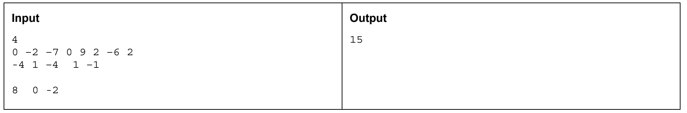

# Max Sum
Implementation by Touro students in MCO364 of the following problem:

Given a two-dimensional array of positive and negative integers, a sub-rectangle is any contiguous sub-array of size
1 × 1 or greater located within the whole array. The sum of a rectangle is the sum of all the elements in that
rectangle.

Input an N × N array of integers. The input begins with a single positive integer N on a line by itself,
indicating the size of the square two-dimensional array. Output the sum of the maximal sub-rectangle.

### Contributors
Jennifer Komendant (https://github.com/jkomendant)    
Lillian Liebman (https://github.com/lliebman)  
Shana Weinfeld (https://github.com/shweinfeld)

